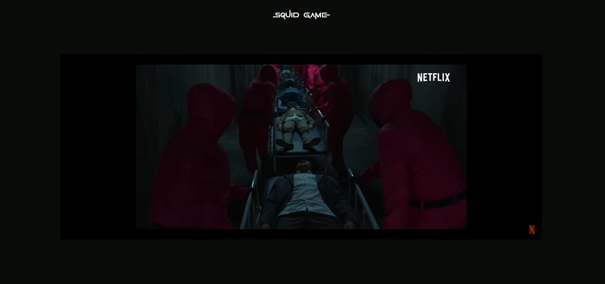
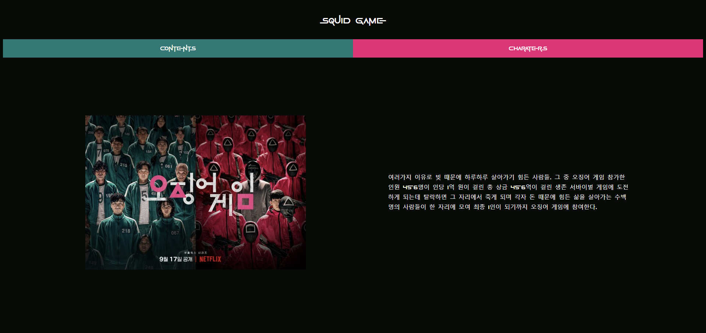
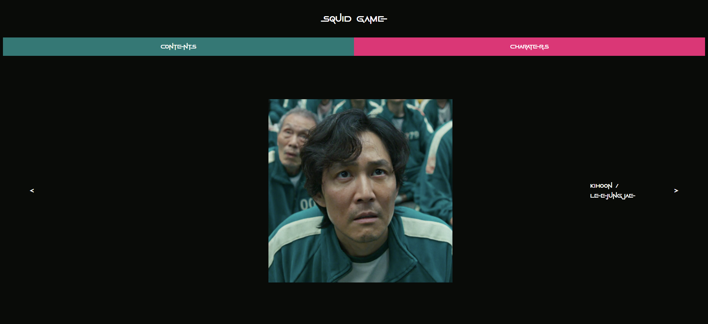
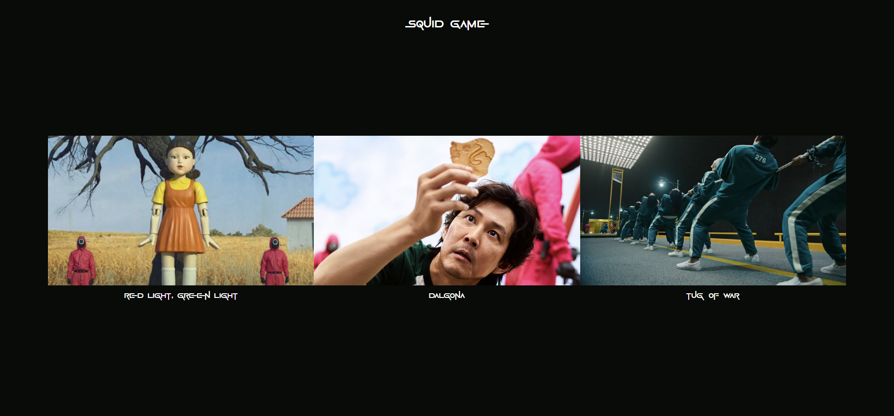
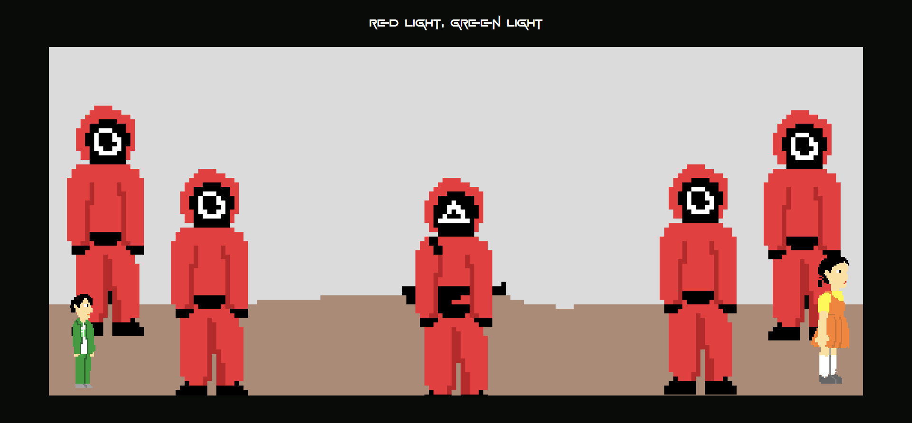
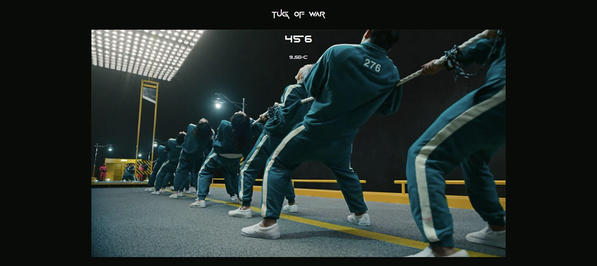

# 🔴🔺🟥 squid game 웹 게임 🟥🔺🔴

## 프로젝트 구경하기
[링크 바로가기](https://pkyung.github.io/squid_game)

## 프로젝트 소개
본 프로젝트는 22학년도 2학기 웹프로그래밍 과제로 진행한 프로젝트로 당시 넷플릭스 드라마 오징어 게임이 성행했고, 드라마에 나온 게임을 웹으로 제작하면 어떨까 싶은 마음에 제작하게 되었습니다. 

## 화면 구성 📺
| 메인 페이지  |  트레일러 페이지   |
| :-------------------------------------------: | :-------------------------------------------: |
|   |     |
|  드라마 설명 페이지   |  드라마 인물 설명 페이지   |
|    |     |
|  게임 선택 페이지   |    무궁화 꽃이 피었습니다 게임   |
|    |    |
|무궁화 꽃이 피었습니다, 달고나 게임, 줄다리기 게임 중 하나를 고를 수 있다. |방향키를 이용하여 캐릭터를 이동 시킬 수 있으며, 영희가 뒤를 돌아볼 때 움직이면 총을 맞는다.|
|  달고나 게임   |    줄다리기 게임   |
|    |    |
|달고나 세 개 중 하나를 골라서 게임을 시작하면 터치를 통해 달고나를 부술 수 있다. |10초 안에 스페이스 바를 456번 눌러야 하는 게임으로 연속해서 누를 수 있다.|